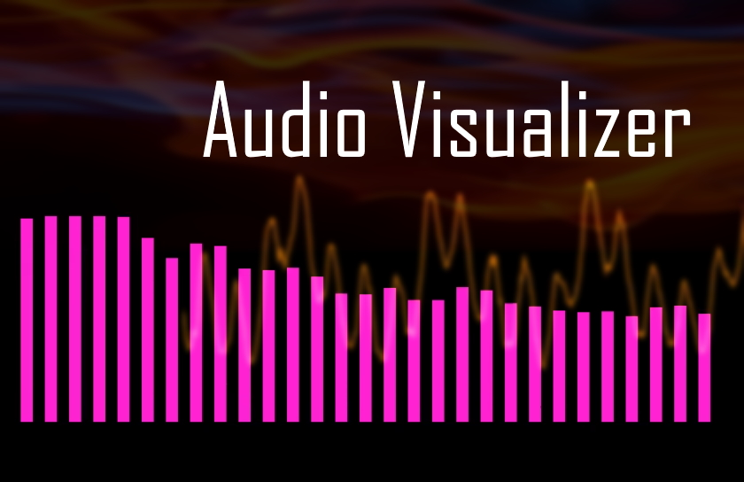

Audio Visualizer
====

## Description
Web上で使用できるオーディオビジュアライザーです．3種類あり，ボタンで切り替えられます．

## Demo
[https://akkunlab.github.io/audiovisualizer/](https://akkunlab.github.io/audiovisualizer/)

## Licence
[MIT](LICENSE)